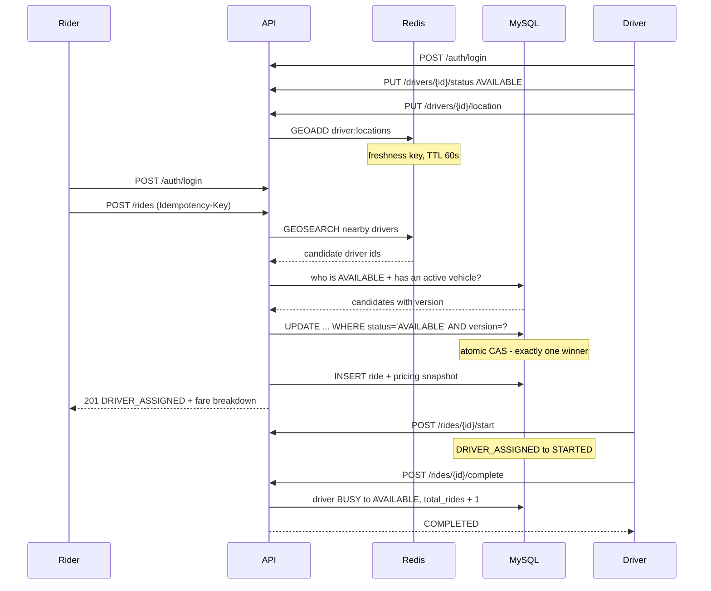

# End-to-End Ride Workflow

A complete, runnable walkthrough of one ride — from rider login to a completed
trip and its audit trail. Every request is copy-pasteable.

Companion to [README.md](README.md), which explains *why* the system is built
this way. This document is *how you drive it*.

> **Verification status.** Steps 1–9 and every alternate flow except the Delhi
> city-pricing example were executed against a live MySQL + Redis and the
> responses below are real. The city-pricing section is written from the code
> and migration but has not been run yet.

---

## Contents

1. [The flow at a glance](#the-flow-at-a-glance)
2. [Step 0 — Prerequisites](#step-0--prerequisites)
3. [Step 1 — Rider login](#step-1--rider-login)
4. [Step 2 — Driver onboarding and login](#step-2--driver-onboarding-and-login)
5. [Step 3 — Driver goes online](#step-3--driver-goes-online)
6. [Step 4 — Book the ride](#step-4--book-the-ride)
7. [Step 5 — Understanding the bill](#step-5--understanding-the-bill)
8. [Step 6 — Start the ride](#step-6--start-the-ride)
9. [Step 7 — Ride in progress](#step-7--ride-in-progress)
10. [Step 8 — Complete the ride](#step-8--complete-the-ride)
11. [Step 9 — Verify the aftermath](#step-9--verify-the-aftermath)
12. [Alternate flows](#alternate-flows)
13. [Status reference](#status-reference)
14. [Troubleshooting](#troubleshooting)

---

## The flow at a glance



---

## Run it automatically

Everything below is executable. `scripts/e2e-ride-workflow.sh` drives the whole
flow and asserts each result:

```bash
BASE=http://localhost:8080/api/v1 ./scripts/e2e-ride-workflow.sh
```

```
1. Rider login
  PASS  rider token issued
...
6. Book a ride
  PASS  ride assigned
  PASS  distance computed
...
Result: 26 passed, 0 failed
```

CI runs the same script on every push and pull request
(`.github/workflows/e2e-ride-workflow.yml`) against real MySQL 8 and Redis 7
service containers — so migrations, JPA mappings, the security chain and Redis
GEO are all exercised, which no unit test would cover.

## Step 0 — Prerequisites

```bash
# MySQL 8 + Redis 7 running (Homebrew or Docker)
brew services start mysql && brew services start redis
# or: docker compose up -d

./mvnw spring-boot:run
```

Set a base URL once; every snippet below uses it:

```bash
export BASE=http://localhost:8080/api/v1
```

---

## Step 1 — Rider login

```bash
RIDER_TOKEN=$(curl -s -X POST $BASE/auth/login \
  -H 'Content-Type: application/json' \
  -d '{"email":"rahul@ridehailing.com","password":"User@123"}' \
  | python3 -c "import sys,json;print(json.load(sys.stdin)['data']['accessToken'])")

echo "rider token: ${#RIDER_TOKEN} chars"
```

Response shape:

```json
{
  "success": true,
  "data": {
    "accessToken": "eyJhbGciOiJIUzI1NiJ9...",
    "tokenType": "Bearer",
    "expiresInSeconds": 3600,
    "userId": 2,
    "email": "rahul@ridehailing.com",
    "role": "USER",
    "permissions": ["RIDE_CREATE", "RIDE_READ", "RIDE_CANCEL", "COUPON_VALIDATE", "..."]
  },
  "requestId": "0b3f...",
  "timestamp": "2026-08-10T09:55:12.482Z"
}
```

**Permissions are baked into the token**, so authorisation costs no database
round-trip. The trade-off: changing a role's permissions does not affect tokens
already issued until they expire (1 hour).

Rate limited to **5 logins/minute per IP**. Wrong password and unknown email
both return `INVALID_CREDENTIALS`, so the endpoint cannot enumerate accounts.

---

## Step 2 — Driver onboarding and login

Seeded drivers exist already — skip to the login if you just want to book.

```bash
# Onboard a new driver (public). Creates the login account AND the profile
# in one transaction: a profile that cannot authenticate is not a valid state.
curl -s -X POST $BASE/drivers \
  -H 'Content-Type: application/json' \
  -d '{"fullName":"Test Driver","email":"test.driver@ridehailing.com",
       "password":"Driver@123","phone":"+919812345670",
       "licenseNumber":"KA-DL-2024-0007"}'
```

Login as a seeded driver (Raj Kumar, `driverId = 1`, SEDAN `KA01AB1234`):

```bash
DRIVER_TOKEN=$(curl -s -X POST $BASE/auth/login \
  -H 'Content-Type: application/json' \
  -d '{"email":"raj.kumar@ridehailing.com","password":"Driver@123"}' \
  | python3 -c "import sys,json;print(json.load(sys.stdin)['data']['accessToken'])")

curl -s $BASE/drivers/1 -H "Authorization: Bearer $DRIVER_TOKEN"
```

```json
{"success":true,"data":{
  "id":1,"userId":5,"fullName":"Raj Kumar","phone":"+919100000001",
  "licenseNumber":"KA-DL-2019-0001","status":"AVAILABLE",
  "rating":4.8,"totalRides":0,"createdAt":"2026-08-10T15:19:27.228093Z"}}
```

A new driver also needs a vehicle before they can be matched:

```bash
curl -s -X POST $BASE/drivers/1/vehicles \
  -H "Authorization: Bearer $DRIVER_TOKEN" -H 'Content-Type: application/json' \
  -d '{"carType":"SEDAN","registrationNumber":"KA01AB1234",
       "make":"Honda","model":"City","color":"White"}'
```

A driver has **at most one active vehicle** — registering a new one deactivates
the previous, in a single transaction.

---

## Step 3 — Driver goes online

Two separate things, both required.

```bash
# 3a. Availability - persistent state in MySQL
curl -s -X PUT $BASE/drivers/1/status \
  -H "Authorization: Bearer $DRIVER_TOKEN" -H 'Content-Type: application/json' \
  -d '{"status":"AVAILABLE"}'

# 3b. Position - Redis GEO only. Returns 204.
curl -s -o /dev/null -w "%{http_code}\n" -X PUT $BASE/drivers/1/location \
  -H "Authorization: Bearer $DRIVER_TOKEN" -H 'Content-Type: application/json' \
  -d '{"latitude":12.9750,"longitude":77.5990}'
```

> ### ⚠️ The single most common cause of `NO_DRIVER_IN_RADIUS`
>
> A GPS ping writes a freshness marker with a TTL of
> `driver.location.ttl.seconds` (**60 s**). Once it expires, the next search
> treats the driver as stale, removes them from the GEO set and skips them.
>
> This is correct — a driver who stopped reporting must not be dispatched — but
> it means **seeded drivers stop being bookable ~60 s after the app starts**.
> Ping again immediately before booking.

Only `OFFLINE ↔ AVAILABLE` may be set here. `BUSY` is owned by ride reservation;
setting it directly returns `DRIVER_HAS_ACTIVE_RIDE` (409). Going `OFFLINE` also
removes the driver's Redis location.

GPS updates are rate limited to **60/minute** and never write to MySQL — that
would be a write hotspot.

---

## Step 4 — Book the ride

```bash
curl -s -X POST $BASE/rides \
  -H "Authorization: Bearer $RIDER_TOKEN" \
  -H 'Content-Type: application/json' \
  -H "Idempotency-Key: $(uuidgen)" \
  -H "X-Request-Id: booking-demo-1" \
  -d '{"pickupLatitude":12.9716,"pickupLongitude":77.5946,"pickupAddress":"MG Road",
       "dropLatitude":12.9081,"dropLongitude":77.6476,"dropAddress":"HSR Layout",
       "carType":"HATCHBACK"}'
```

**Note what is *not* in the body: `userId`.** The rider is always the
authenticated principal — a caller can never book in someone else's name.

`201 Created`:

```json
{
  "success": true,
  "data": {
    "id": 2,
    "status": "DRIVER_ASSIGNED",
    "userId": 3,
    "driverId": 1,
    "driver": {"id":1,"fullName":"Raj Kumar","phone":"+919100000001","rating":4.8},
    "vehicleId": 1,
    "requestedCarType": "HATCHBACK",
    "assignedCarType": "SEDAN",
    "carTypeUpgraded": true,
    "distanceKm": 9.102,
    "fare": {
      "pricingRuleCode": "STANDARD",
      "pricingZoneCode": "BANGALORE",
      "distanceFare": 64.51,
      "carTypeMultiplier": 0.9,
      "surgeMultiplier": 1.0,
      "minimumFare": 50.00,
      "minimumFareApplied": false,
      "fareBeforeDiscount": 58.06,
      "couponCode": null,
      "discountAmount": 0.00,
      "totalFare": 58.06
    },
    "requestedAt": "2026-08-10T09:56:39.821Z",
    "assignedAt":  "2026-08-10T09:56:39.821Z"
  },
  "requestId": "booking-demo-1"
}
```

Here a **HATCHBACK was requested but a SEDAN assigned** — Amit Sharma's
hatchback was already busy. `carTypeUpgraded: true`, and the rider still pays the
hatchback multiplier (0.9). No extra charge, ever.

### What happened inside

```
rate limit (10/min/user)
   ↓ idempotency  — unique (user_id, idempotency_key)
   ↓ validation   — coordinates in range, pickup ≠ drop, distance > 0
   ↓ config       — ride.search.radius.km, matching.strategy
   ↓ Redis GEO    — nearby driver ids            ← CANDIDATES ONLY
   ↓ MySQL        — who is AVAILABLE + active vehicle of an acceptable type
   ↓ ranking      — NearestDriverMatchingStrategy, requested car type first
   ↓ pricing      — quote built BEFORE the transaction opens
   ↓ ┌── TRANSACTION ─────────────────────────
   ↓ │  UPDATE drivers SET status='BUSY' WHERE status='AVAILABLE' AND version=?
   ↓ │  INSERT ride + pricing snapshot
   ↓ │  redeem coupon
   ↓ └── COMMIT ─────────────────────────────
   ↓ audit (ride created, driver AVAILABLE→BUSY)
```

**Redis only nominates candidates. MySQL decides who was actually reserved.** If
the conditional UPDATE affects 0 rows, another booking won that driver and the
next candidate is tried.

---

## Step 5 — Understanding the bill

Every number in `fare` is reproducible. For this 9.102 km HATCHBACK trip under
the seeded `STANDARD` rule (min ₹50; 0–2 km ₹10, 2–5 km ₹8, 5+ km ₹5;
HATCHBACK ×0.9):

| Step | Calculation | Amount |
|---|---|---|
| Tier 0–2 km | 2.000 × 10 | 20.00 |
| Tier 2–5 km | 3.000 × 8 | 24.00 |
| Tier 5+ km | 4.102 × 5 | 20.51 |
| **Distance fare** | sum | **64.51** |
| Car type | × 0.9 (HATCHBACK) | 58.06 |
| Surge | × 1.0 (`surge.enabled=false`) | 58.06 |
| Minimum fare | max(58.06, 50.00) → not applied | 58.06 |
| Coupon | none | −0.00 |
| **Total** | | **₹58.06** |

Slab pricing: each tier bills only the part of the trip inside its own interval.

The full itemised breakdown, including one line per tier, is stored on the ride
as JSON in `rides.fare_breakdown`.

### Why the snapshot matters

Every fare input — rule code, zone code, tier amounts, multipliers, minimum fare
— is **copied onto the ride row** at booking time. Change pricing tomorrow and
this ride still shows ₹58.06 forever. Pricing rules are never joined at read
time.

### Check a coupon before booking

```bash
curl -s -X POST $BASE/coupons/WELCOME10/validate \
  -H "Authorization: Bearer $RIDER_TOKEN" -H 'Content-Type: application/json' \
  -d '{"fareAmount":250.00}'
```

```json
{"success":true,"data":{"valid":true,"code":"WELCOME10",
  "discountAmount":25.00,"payableAmount":225.00}}
```

This endpoint **never throws** for an unusable coupon — it returns
`valid: false` with a reason, so the UI can show it inline:

```json
{"success":true,"data":{"valid":false,"code":"WELCOME10","discountAmount":0.00,
  "reason":"COUPON_NOT_APPLICABLE",
  "message":"Coupon WELCOME10 requires a fare of at least 100.00"}}
```

To apply it, add `"couponCode":"WELCOME10"` to the booking body. Redemption
happens **inside the ride-creation transaction** — a coupon can never be consumed
by a ride that failed to persist.

---

## Step 6 — Start the ride

```bash
curl -s -X POST $BASE/rides/2/start -H "Authorization: Bearer $DRIVER_TOKEN"
```

```json
{"success":true,"data":{"id":2,"status":"STARTED",
  "startedAt":"2026-08-10T09:57:02.118Z", "...":"..."}}
```

`DRIVER_ASSIGNED → STARTED`. Only the **assigned driver** or an ADMIN may do
this — and the driver identity is resolved from the JWT, not from the request.

The rider trying the same call:

```json
{"success":false,"error":{"code":"ACCESS_DENIED",
  "message":"Only the assigned driver may change this ride"}}
```

---

## Step 7 — Ride in progress

There is no separate "in progress" state — `STARTED` **is** in progress. Poll the
ride:

```bash
curl -s $BASE/rides/2 -H "Authorization: Bearer $RIDER_TOKEN"
```

Readable by the **rider**, the **assigned driver**, or an **ADMIN**. Anyone else
gets `ACCESS_DENIED`, even with the `RIDE_READ` permission — permission says
*what* you may do, ownership says *which rows*.

To follow the driver live, they keep pinging their location (step 3b) and the
rider polls the ride. There is no push channel and no ETA endpoint yet.

Calling `start` again is rejected — the state machine is explicit:

```json
{"success":false,"error":{"code":"INVALID_RIDE_STATE_TRANSITION",
  "message":"A ride cannot move from STARTED to STARTED"}}
```

---

## Step 8 — Complete the ride

```bash
curl -s -X POST $BASE/rides/2/complete -H "Authorization: Bearer $DRIVER_TOKEN"
```

```json
{"success":true,"data":{"id":2,"status":"COMPLETED",
  "completedAt":"2026-08-10T09:57:44.902Z",
  "fare":{"totalFare":58.06,"...":"..."}}}
```

`STARTED → COMPLETED`. In the same transaction the driver is released:

```sql
UPDATE driver_schema.drivers
   SET status = 'AVAILABLE', total_rides = total_rides + 1, version = version + 1
 WHERE id = ? AND status = 'BUSY';
```

One atomic statement, so a replayed completion cannot double-count the ride.
**The fare does not change at completion** — it was fixed at booking.

---

## Step 9 — Verify the aftermath

```bash
# Driver is free again and the counter moved
curl -s $BASE/drivers/1 -H "Authorization: Bearer $DRIVER_TOKEN"
#   "status": "AVAILABLE", "totalRides": 1

# Rider's history, newest first
curl -s "$BASE/users/3/rides?page=0&size=20" -H "Authorization: Bearer $RIDER_TOKEN"

# Driver's history
curl -s "$BASE/drivers/1/rides?page=0&size=20" -H "Authorization: Bearer $DRIVER_TOKEN"
```

### The audit trail

```bash
ADMIN_TOKEN=$(curl -s -X POST $BASE/auth/login -H 'Content-Type: application/json' \
  -d '{"email":"admin@ridehailing.com","password":"Admin@123"}' \
  | python3 -c "import sys,json;print(json.load(sys.stdin)['data']['accessToken'])")

curl -s "$BASE/admin/audit-logs?entityType=Ride&entityId=2" \
  -H "Authorization: Bearer $ADMIN_TOKEN"
```

One complete ride produces exactly these rows:

| entity | id | action | old → new | by |
|---|---|---|---|---|
| Ride | 2 | `RIDE_CREATED` | — → `DRIVER_ASSIGNED` | priya@ridehailing.com |
| Driver | 1 | `DRIVER_STATUS_CHANGED` | `AVAILABLE` → `BUSY` | priya@ridehailing.com |
| Ride | 2 | `RIDE_STATUS_CHANGED` | `DRIVER_ASSIGNED` → `STARTED` | raj.kumar@ridehailing.com |
| Ride | 2 | `RIDE_STATUS_CHANGED` | `STARTED` → `COMPLETED` | raj.kumar@ridehailing.com |
| Driver | 1 | `DRIVER_STATUS_CHANGED` | `BUSY` → `AVAILABLE` | raj.kumar@ridehailing.com |

Every row carries the `X-Request-Id` of the call that caused it, so you can ask
"what did this one request change?":

```bash
curl -s "$BASE/admin/audit-logs?requestId=booking-demo-1" \
  -H "Authorization: Bearer $ADMIN_TOKEN"
```

Reads are deliberately **not** audited — a noisy audit trail is a useless one.

---

## Alternate flows

### Cancel

```bash
curl -s -X POST $BASE/rides/2/cancel \
  -H "Authorization: Bearer $RIDER_TOKEN" -H 'Content-Type: application/json' \
  -d '{"reason":"Changed my plans"}'
```

Legal only from `REQUESTED` or `DRIVER_ASSIGNED`. Side effects: the driver goes
back to `AVAILABLE`, and any coupon redemption is **reversed** so the rider gets
the use back. `cancelledBy` is derived from the authenticated role — never from
the body — so a rider cannot log a cancellation as the driver's fault.

### Idempotent retry

```bash
KEY=$(uuidgen)
curl -s -X POST $BASE/rides -H "Authorization: Bearer $RIDER_TOKEN" \
  -H 'Content-Type: application/json' -H "Idempotency-Key: $KEY" -d "$BODY"
curl -s -X POST $BASE/rides -H "Authorization: Bearer $RIDER_TOKEN" \
  -H 'Content-Type: application/json' -H "Idempotency-Key: $KEY" -d "$BODY"
```

Same `rideId` both times — **no second ride**. The guarantee is the unique key
`(user_id, idempotency_key)`, not an application-level check.

| Situation | Result |
|---|---|
| Same key, same body | original response replayed |
| Same key, different body | `422 IDEMPOTENCY_KEY_REUSED` |
| Same key, still in flight | `409 REQUEST_ALREADY_IN_PROGRESS` |
| Previous attempt failed | key released, retry allowed |

### Rate limiting

Eleven bookings in a minute — the eleventh:

```
HTTP/1.1 429
Retry-After: 60
X-Request-Id: 10febc64-...
```

### No driver available

```json
{"success":false,"error":{"code":"NO_DRIVER_IN_RADIUS",
  "message":"No available driver found within 5.0 km"}}
```

Widen the search without a deployment:

```bash
curl -s -X PUT $BASE/configurations/ride.search.radius.km \
  -H "Authorization: Bearer $ADMIN_TOKEN" -H 'Content-Type: application/json' \
  -d '{"value":"12"}'
```

That brings Vikram Singh (5.2 km) and Neha Verma (10.5 km) into range.

### City-based pricing *(not yet run against a live DB)*

Fares depend on the **pickup** location. Seeded zones:

| Zone | Centre | Radius | Rule | Min fare | ₹/km |
|---|---|---|---|---|---|
| `DELHI` | 28.6139, 77.2090 | 50 km | `DELHI_STANDARD` | ₹60 | 12 / 9 / 6 |
| `PUNE` | 18.5204, 73.8567 | 30 km | `PUNE_STANDARD` | ₹45 | 9 / 7 / 5 |
| `BANGALORE` | 12.9716, 77.5946 | 40 km | `STANDARD` | ₹50 | 10 / 8 / 5 |

To demo Delhi pricing you must first put a driver there — the GEO search runs
*before* pricing, so with no nearby driver you get `NO_DRIVER_IN_RADIUS` and the
Delhi rates are never reached. Postman folder **9. City pricing demo** does the
whole setup in order.

---

## Status reference

### Ride

```
REQUESTED ──▶ DRIVER_ASSIGNED ──▶ STARTED ──▶ COMPLETED
    │                │
    └──▶ CANCELLED ◀─┘
```

| From | Allowed next | Who |
|---|---|---|
| `REQUESTED` | `DRIVER_ASSIGNED`, `CANCELLED` | system / rider |
| `DRIVER_ASSIGNED` | `STARTED`, `CANCELLED` | assigned driver, rider, ADMIN |
| `STARTED` | `COMPLETED` | assigned driver, ADMIN |
| `COMPLETED` / `CANCELLED` | *terminal* | — |

Anything else → `409 INVALID_RIDE_STATE_TRANSITION`.

### Driver

| Status | Meaning | Set by |
|---|---|---|
| `OFFLINE` | not working | driver |
| `AVAILABLE` | bookable | driver |
| `BUSY` | on a ride | **ride reservation only** |

---

## Troubleshooting

| Symptom | Cause | Fix |
|---|---|---|
| `NO_DRIVER_IN_RADIUS` | location ping older than 60 s | ping again (step 3b) |
| `NO_DRIVER_IN_RADIUS` with a fresh ping | driver `OFFLINE`/`BUSY`, no active vehicle, or wrong car type | check `GET /drivers/{id}` and its vehicles |
| `ACCESS_DENIED` on your own ride | wrong token — driver token for a rider action | use the matching role's token |
| `COUPON_NOT_APPLICABLE` | fare below the coupon minimum | longer trip, or a different coupon |
| `429` | rate limit | wait for `Retry-After` |
| `INVALID_RIDE_STATE_TRANSITION` | ride already moved on | `GET /rides/{id}` to see the real status |
| `Port 8080 was already in use` | another process | stop it, or `SERVER_PORT=8081 ./mvnw spring-boot:run` |
| `Unknown database 'ridehailing'` | schema dropped without recreating | see README §5 |
| `Detected failed migration to version N` | schemas dropped but `ridehailing` kept (or vice versa) | drop **all eight schemas *and* `ridehailing`** together, recreate `ridehailing`, restart |
